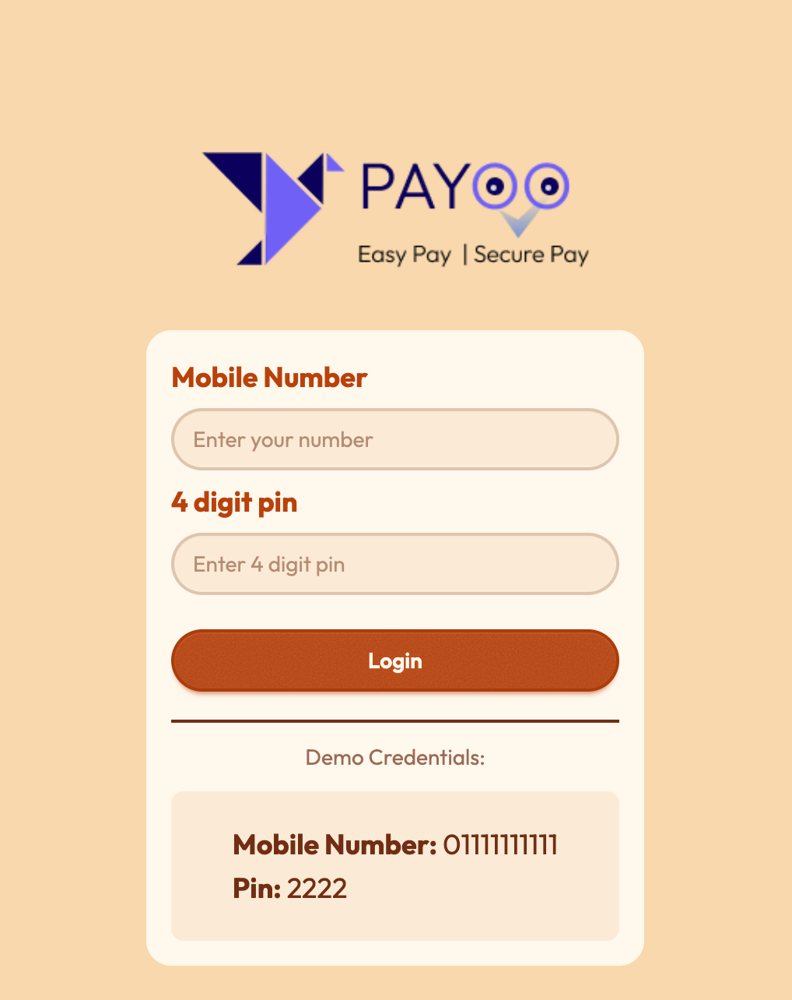
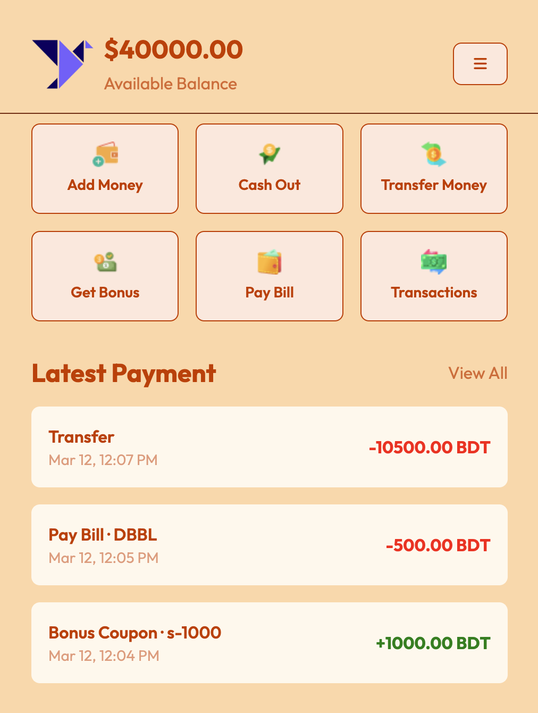

<h1 align="center">💸 Payoo</h1>

A simple mobile banking demo app to manage personal transactions — add money, cash out, transfer funds, pay bills, redeem coupons, and track transaction history.

<a href="https://payoo-banking-web-app.netlify.app/">🔗 Live Demo</a>

---

## ✨ Features

- Login with **mobile number and 4-digit PIN**
- **Add money, cash out, transfer funds, pay bills, and redeem coupons**
- **Transaction history** with date and color-coded amounts
- **Insufficient balance protection** for transactions
- **Inline form validation** with error messages
- **View All / View Less** toggle for transaction history
- Logged-in user's number displayed in the **menu**
- **Fully responsive** mobile-first layout

---
## 📸 Preview

| Login Page | Dashboard |
|-----------|-----------|
|  |  |

---

## 📚 What I learned & how I applied it here

In this project, I focused mainly on **DOM manipulation**, **session-based authentication**, and **input validation**.

For **DOM manipulation**, I used JavaScript to dynamically show and hide sections based on user actions. Balance updates, transaction cards, active button highlights, and error messages update instantly without reloading the page.

For **authentication**, I used `sessionStorage` to manage the login state. Login state is stored with `isLoggedIn`, and route guards redirect unauthenticated users to the login page while preventing logged-in users from returning there.

While building this project, I also learned the difference between `window.location.assign()` and `window.location.replace()`. The `assign()` method adds the current page to browser history, while `replace()` removes it completely. Using `replace()` for authentication redirects prevents users from navigating back to restricted pages.

For **input handling**,I applied regex rules: `only-digit` fields for PIN/phone numbers, and `decimal-digit` fields with one decimal point up to two places.

---

## ⚙️ Challenges I ran into

**Handling the browser back button after login.**  
My first approach used `history.pushState()` to stop users from navigating back to the login page after logging in. However, placing it inside the `pageshow` event caused an infinite loop because `pushState` kept retriggering the event.

The solution was simpler: instead of manipulating browser history, I relied on **authentication guards**. Logged-in users landing on the login page are redirected to home, and unauthenticated users landing on the home page are redirected to login.
---

## 🛠 Built with

HTML · Tailwind CSS v4 · DaisyUI v5 · Vanilla JavaScript · Font Awesome

---

## 👨‍💻 Author

**Ratul** — currently learning web development and building small projects to practice.

[GitHub](https://github.com/Ratul-Ai) | [linkedin](https://www.linkedin.com/in/md-ratul242/)